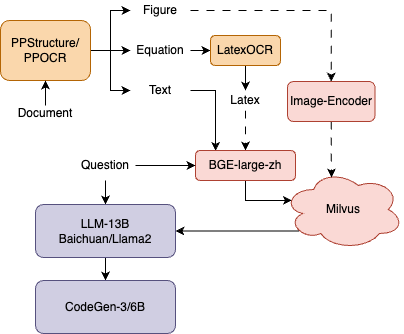

# <center> Virtual Teaching Assistant
<div align=center></div>

## Update 
### version-2.0
- BGE模型更新为1.5版本
- 接入微信助手

### version-1.1
- 增加图片输入。处理逻辑：
    - 仅文本输入。文本输入为提问内容
    - 仅图片输入。图片输入为提问内容
    - 图文共同输入。文本为提问内容，图片为附加提示内容
- 增加表格ocr（也支持常规文本），仅用于图片输入使用，识别精度有待提升。
- 优化交互页面布局。

### version-1.0
- OCR后的数据如出现有序/无序列表，将作为完整的样本存入数据库（除非超出最大字符数），最大字符数从300扩大为500。
- 将工程中所有的api放置于`api.py`中。
- 数据库特征比较的方法由L1改为L2距离，`distance`有更好的一致性，可以更公平地比较不同书目或数据长度的内容信息。
- 为适应软件考试助手的功能：
    - 新建`config/documents.yaml`和`config/cfg.py`，用于映射各个数据库表对应的书目名称。
    - `load_data.py`中新增针对例题解析的处理方法`load_pdf_jiexi`。
    - 将`citation`（引用书目的名称和页数）从`search.py`方法的返回值中独立出来，以便应对无需索引页数的场景，如：真题。对于真题，在数据库存储的时候，页数设为0或-1。

## TODO
- [ ] v2.1 多轮对话
- [ ] v2.1 Prompt添加页数信息
- [ ] v2.2 尝试30B模型

## Install
- Ubuntu: 22.04
- CUDA Version: 11.3
- Python 3.10.12
- torch 2.0.1
```bash
# 安装环境
conda env create -f environment.yml
```
#### 安装向量数据库
1. 安装docker-compose
```bash
cd /usr/local/bin/
sudo curl -SL https://github.com/docker/compose/releases/download/v2.3.3/docker-compose-linux-x86_64 -o docker-compose
sudo chmod 755 docker-compose
docker-compose -v
```
2. 下载配置文件与容器
```bash
cd [YourPath]/Milvus
wget https://github.com/milvus-io/milvus/releases/download/v2.2.12/milvus-standalone-docker-compose.yml -O docker-compose.yml

sudo docker-compose up -d
# 最后显示以下内容
[+] Running 4/4
 ⠿ Network milvus               Created                                    0.1s
 ⠿ Container milvus-etcd        Started                                    1.1s
 ⠿ Container milvus-minio       Started                                    2.1s
 ⠿ Container milvus-standalone  Started                                    2.6s
```
3. 确认容器是否启动
```bash
sudo docker-compose ps
# 显示以下内容
NAME                COMMAND                  SERVICE             STATUS              PORTS
milvus-etcd         "etcd -advertise-cli…"   etcd                running             2379-2380/tcp
milvus-minio        "/usr/bin/docker-ent…"   minio               running (healthy)   9000/tcp
milvus-standalone   "/tini -- milvus run…"   standalone          running             0.0.0.0:9091->9091/tcp, 0.0.0.0:19530->19530/tcp, :::9091->9091/tcp, :::19530->19530/tcp
```

4. 确认网络端口和容器端口连接通畅
```bash
sudo docker port milvus-standalone 19530/tcp
# 显示以下内容
0.0.0.0:19530
:::19530
```

#### 下载OCR模型、文本编码模型和语言大模型
1. 安装torch，transformers
```bash
pip3 install torch torchvision torchaudio
pip3 install transformers
```

2. 下载大模型。运行相应文件就会自动下载，注意修改路径</br>
如需其它参数版本的模型，详见[Huggingface](https://huggingface.co/models)或[FlagEmbedding](https://github.com/FlagOpen/FlagEmbedding/blob/master/README_zh.md)</br>
```python
from transformers import AutoModelForCausalLM, AutoTokenizer
device = "cuda" # the device to load the model onto
model = AutoModelForCausalLM.from_pretrained(
    "Qwen/Qwen1.5-14B-Chat",
    torch_dtype="auto",
    device_map="auto"
)
```
```python
# .database/emb_model.py
from transformers import AutoModelForCausalLM, AutoModel
model = AutoModelForCausalLM.from_pretrained("BAAI/bge-large-zh-v1.5", cache_dir=[YourPath])
tokenizer = AutoTokenizer.from_pretrained('BAAI/bge-large-zh-v1.5')
```

3. 安装PaddleOCR</br>
[点击此处](https://www.paddlepaddle.org.cn/)选择特定版本
```bash
pip3 install paddlepaddle -i https://mirror.baidu.com/pypi/simple
pip3 install "paddleocr>=2.0.1"
```

4. 安装LatexOCR，并下载模型放入`.latexocr/models`文件夹下 (可选)</br>
模型下载地址：[Google Drive](https://drive.google.com/drive/folders/1e8BgLk1cPQDSZjgoLgloFYMAQWLTaroQ?usp=sharing) | [Baidu NetDisk](https://pan.baidu.com/s/1rnYmmKp2HhOkYVFehUiMNg?pwd=dh72)</br>
其它问题详见：[Rapid Latex OCR](https://github.com/RapidAI/RapidLatexOCR)</br>
```bash
pip3 install rapid_latex_ocr
```

5. 安装Web应用框架
```
pip3 install flask flask_cors
```

## Usage
1. 启动服务器</br>
运行`server.py`，注意端口设置。
2. 将文档导入向量数据库(如需要)</br>
运行`load_data.py`，注意修改PDF文件路径。
3. 启动大模型</br>
如果服务器算力有限，可将大模型部署于单独的运算平台。注意对齐ip地址和端口号。
4. 启动微信助手(如需要)</br>
运行`wechat.sh`，扫码登陆机器人微信号。再运行`wechat.py`
5. 测试系统是否通畅</br>
运行`request.py`，顺利输出结果即可。

## Create new database
```python
from pymilvus import connections, db

conn = connections.connect(host="127.0.0.1", port=19530)

database = db.create_database("book")
```

## Contact
If you have any question or suggestion related to this project, feel free to open an issue or pull a request. You also can email Minjun Lu(luminjun@shu.edu.cn)